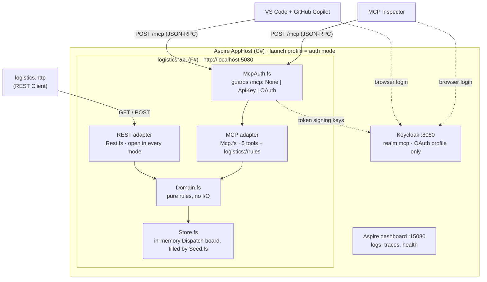

# MCP server in .NET (F#)

An MCP server in F# over a simplified logistics API, run with Aspire and used from GitHub Copilot in VS Code and MCP Inspector, with authentication switchable between none, an API key and OAuth (Keycloak).

**Why:** Copilot can already call a REST API, so what does an MCP server add? The demo shows it on one domain: tools the model discovers on its own, a naive 1:1 tool (`get_drivers`) that gives a confident wrong answer next to a task-shaped tool (`find_dispatch_options`) that gets it right, a mutating tool behind an approval prompt and domain rules, a resource the user attaches as context, and the same server protected by an API key or OAuth with roles.

Inspired by the NDC Oslo 2026 talk ["Old API, New Tricks: Add MCP to Existing .NET REST Endpoints"](https://ndcoslo.com/agenda/old-api-new-tricks-add-mcp-to-existing-dotnet-rest-endpoints) by Jonathan "J." Tower.

**Stack:** .NET 10, F# (API, domain, MCP via `ModelContextProtocol.AspNetCore` 2.2.0), C# Aspire AppHost 13.6.0, xUnit v3 + Unquote.

## What's inside

| Path | What it shows |
|------|---------------|
| `McpServerDotNet.AppHost/` | C# Aspire AppHost. One launch profile per auth mode: `None`, `ApiKey`, `OAuth`. Keycloak realm in `Realms/mcp-realm.json`. |
| `McpServerDotNet.ServiceDefaults/` | C# Aspire ServiceDefaults: OpenTelemetry, health checks (`/health`, `/alive`). |
| `Logistics.Api/` | F# API (resource `logistics-api`): domain, seed, REST adapter (`Rest.fs`), MCP adapter (`Mcp.fs`), auth toggle for `/mcp` (`McpAuth.fs`). |
| `.vscode/mcp.json` | MCP server entries for VS Code / GitHub Copilot: `logistics` (`None`, and `OAuth` with client ID `vscode`) and `logistics-api-key` (`ApiKey` mode). |
| `Logistics.Api.Tests/` | F# tests: `Domain/`, `DemoScenes/` (incl. checks that `logistics.http` and `prompts.md` match the API and seed), `Adapters/`. |
| `prompts.md` | Every prompt typed in the live demo, in scene order. Reuse them after the Session. |
| `logistics.http` | REST calls for the read and dispatch paths, and the scene 6 OAuth discovery (`/mcp` → 401 → Protected Resource Metadata). VS Code REST Client or Rider. |
| `GLOSSARY.md` | Demo domain terms: Driver, Tractor unit, Trailer, Transport Order, Dispatch, Dispatcher, … |
| `materials/slides.html` | Slides. Open in a browser and press `S` for the speaker view. Works offline. |
| `materials/script.md` | Presenter's Script. |
| `materials/cheatsheet.md` | Presenter's cheat sheet: architecture, OAuth in MCP, Keycloak, acronyms, what's next. |

## Architecture

One process, two adapters over one pure F# domain (ports and adapters). The Aspire AppHost starts the API and, in the `OAuth` profile, Keycloak.



### Where to find what

| Question | Look in |
|----------|---------|
| What are the business rules? | `Logistics.Api/Domain.fs` (pure functions over the Dispatch board); the same rules in plain words: resource `logistics://rules` in `Mcp.fs` |
| What does the model see (tool names, descriptions, schemas)? | `Logistics.Api/Mcp.fs` (`[<McpServerTool>]` attributes and `Description`s) |
| How is `/mcp` protected? | `Logistics.Api/McpAuth.fs` (mode switch, JWT validation, Protected Resource Metadata); `Dispatcher.fs` (who dispatched, role name) |
| Where is the server wired up? | `Logistics.Api/Program.fs` (`AddMcpServer`, stateless Streamable HTTP, `MapMcp("/mcp")`) |
| What data is there on start? | `Logistics.Api/Seed.fs` (header comment lists tomorrow's Dispatches and traps) |
| How are the profiles and Keycloak started? | `McpServerDotNet.AppHost/AppHost.cs`, `Properties/launchSettings.json` |
| Keycloak users, roles, clients, audience | `McpServerDotNet.AppHost/Realms/mcp-realm.json` |
| How do I check the demo still matches the code? | `Logistics.Api.Tests/DemoScenes/` |

## Run it

Requires the .NET 10 SDK.

```sh
cd McpServerDotNet
dotnet run --project McpServerDotNet.AppHost --launch-profile None
```

The dashboard opens at http://localhost:15080 (login link in the console). The API listens on http://localhost:5080; `GET /health` returns `Healthy`.

REST (open in every mode): `GET /drivers`, `/drivers/{id}`, `/tractors`, `/trailers`, `/orders` (`?status=open`), `/orders/{id}`, `/orders/{id}/dispatch-options`, `/dispatches`; `POST /dispatches` (body `{orderId, driverId, tractorId, trailerId}`; 201, or 404/409 with the reason as plain text), `DELETE /dispatches/{id}`. Data is in memory and reseeded on every start, with dates relative to startup (see `Logistics.Api/Seed.fs`).

MCP (Streamable HTTP, stateless) on http://localhost:5080/mcp, same process: read-only tools `get_drivers`, `list_open_orders`, `find_dispatch_options`, `get_driver_schedule`, the mutating tool `dispatch_order` (rule violations come back as tool text with `isError: true`; success names the Dispatcher) and the resource `logistics://rules`. VS Code picks the server up from `.vscode/mcp.json` (open the `McpServerDotNet` folder). MCP Inspector: `npx @modelcontextprotocol/inspector`, transport Streamable HTTP, URL above.

To replay the demo, follow [`prompts.md`](./prompts.md) (new chat per scene) and [`logistics.http`](./logistics.http).

### Auth modes

`McpAuth:Mode` (`None | ApiKey | OAuth`) protects `/mcp` only; REST stays open. Pick the mode with the AppHost launch profile and restart to switch (data reseeds).

| Profile | `/mcp` | Dispatcher in `dispatch_order` |
|---------|--------|-------------------------------|
| `None` | open | `anonymous` |
| `ApiKey` | needs header `X-Api-Key` (401 without it) | `api-key` |
| `OAuth` | needs a Keycloak bearer token (401 + `WWW-Authenticate` without it); `dispatch_order` needs role `dispatcher` | `preferred_username` (e.g. `alice`) |

`ApiKey`: the key is the Aspire secret parameter `mcp-api-key`. Set it once in the AppHost user secrets, or leave it unset and enter it in the dashboard when Aspire asks:

```sh
dotnet user-secrets --project McpServerDotNet.AppHost set Parameters:mcp-api-key <key>
dotnet run --project McpServerDotNet.AppHost --launch-profile ApiKey
```

In VS Code start the `logistics-api-key` server; it prompts for the key (password field, not stored in the repo) and sends it as `X-Api-Key`. In MCP Inspector add the header `X-Api-Key` under Authentication. One shared key: no per-user identity, no roles.

`OAuth`: needs Docker. The AppHost starts Keycloak on http://localhost:8080 (admin `admin`/`admin`) with the realm `mcp` from `McpServerDotNet.AppHost/Realms/mcp-realm.json`, and the API validates its tokens (issuer `http://localhost:8080/realms/mcp`, audience `http://localhost:5080/mcp`, flat `roles` claim).

```sh
dotnet run --project McpServerDotNet.AppHost --launch-profile OAuth
```

| User / password | Realm role `dispatcher` | `dispatch_order` |
|-----------------|-------------------------|------------------|
| `alice` / `alice` | yes | allowed, `dispatched by alice` |
| `bob` / `bob` | no | not in bob's `tools/list` at all; calling it by name anyway is a JSON-RPC error `-32600` "Access forbidden: This tool requires authorization." |

Read-only tools need only a signed-in user. Clients: `vscode` (VS Code / Copilot: the `logistics` server, browser login) and `mcp-inspector` (Inspector: client ID `mcp-inspector`, scope `mcp:tools`; it redirects to `http://127.0.0.1:6274/oauth/callback`). `GET /.well-known/oauth-protected-resource` (also `/.well-known/oauth-protected-resource/mcp`, the URL in `WWW-Authenticate`) serves the Protected Resource Metadata.

The Keycloak container is persistent: it keeps running after the AppHost stops, so the next start doesn't wait for it. Keycloak imports the realm only when the container is created, so **after changing `mcp-realm.json` remove the container** (`docker rm -f $(docker ps -aq --filter name=keycloak)`) and start again. Remove it the same way when you are done.

Tests:

```sh
dotnet test
```

Before a Session, check `logistics.http` against the running AppHost (`DEMO_API_MODE=OAuth` for the scene 6 requests while the `OAuth` profile runs):

```sh
DEMO_API_URL=http://localhost:5080 DEMO_API_MODE=None dotnet test --filter "FullyQualifiedName~ArtefactTests"
```

## Sessions

| Date | Audience | Notes |
|------|----------|-------|
